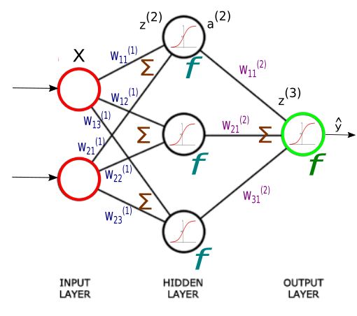

# **A Basic and Simple Neural Network**

This program is a simple neueal network with two input layers, three hidden layers and an output. **Numpy** is the **only** library used for coding.

The sigmoid activation function is used for coding. There is another **Jupyter** file including some different activation functions:
- Identity
- Binary step
- sigmoid
- Hyperbolic tangent 
- ReLU
- Gaussian Error Linear Unit (GELU)
- Softplus
- ELU
- Leaky ReLU
- PReLU
- SiLU
- Gaussian

You can see different types of functions, their derivatives and their graphs.
